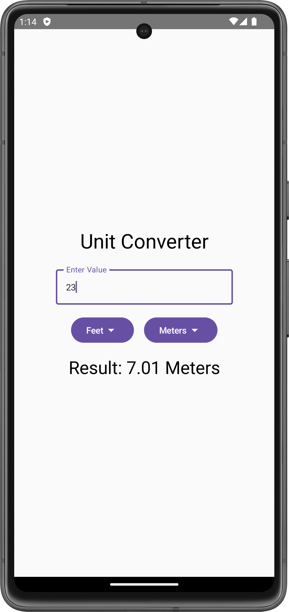
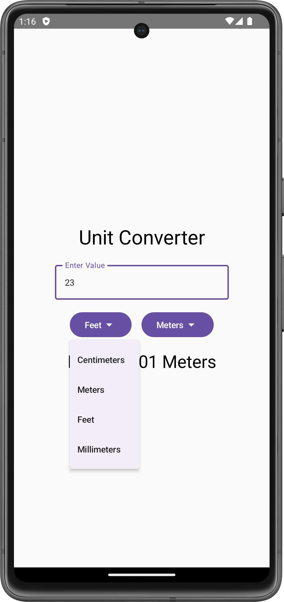

# Unit Converter Android App

This repository contains a simple Unit Converter app built using Kotlin and Jetpack Compose. The app supports unit conversion (e.g., meters, feet, centimeters, millimeters) and demonstrates basic Kotlin fundamentals and Compose UI features like `OutlinedTextField`, `DropdownMenu`, and icons.

## Features

### 1. **OutlinedTextField with Dropdown Menus**
   - Input values using `OutlinedTextField` and select units through dropdown menus with icons (e.g., `ArrowDropDown`).

### 2. **Kotlin Fundamentals**
   - **State Management**: The app uses `remember` and `mutableStateOf` to manage input values, unit selections, and conversion factors.
   - **Conversion Logic**: The `convertUnits()` function uses Kotlin fundamentals like the Elvis operator (`?:`) to handle null values and performs mathematical operations for conversion.

### 3. **Dynamic UI**
   - Real-time unit conversion updates as users change input or output units.
   - Layout built using `Column` and `Row` components for a clean, responsive design.

## How to Use

1. **Input Value**: Enter a numeric value in the `OutlinedTextField`.
2. **Select Units**: Use the dropdown menus to select the input and output units.
3. **View Result**: The conversion result updates automatically based on the selected units.

# Code Highlights

## Function to convert various units 

```kotlin
// Code Highlights
fun convertUnits() {
    val inputValueDouble = inputValue.toDoubleOrNull() ?: 0.0
    val result = (inputValueDouble * conversionFactor.value / oConversionFactor.value).roundToInt() / 100.0
    outputValue = result.toString()
}
```
## Dropdown Menu Example
```kotlin
// Dropdown Menu Example
Button(onClick = { iExpanded = true }) {
    Text(text = inputUnit)
    Icon(Icons.Default.ArrowDropDown, contentDescription = "Arrow Down")
}
DropdownMenu(expanded = iExpanded, onDismissRequest = { iExpanded = false }) {
    DropdownMenuItem(text = { Text("Meters") }, onClick = { /* conversion logic */ })
}
```


## Screenshots *(Pixel 7 virtual device)*
<div align="center">
<!-- Main Screen -->

<p style="text-align:center;"><em>Main screen with unit selection and result display.</em></p>

<!-- Dropdown Menu -->

<p style="text-align:center;"><em>Dropdown menu for selecting units.</em></p>
</div>

# Getting Started

## Prerequisites
- Android Studio Flamingo or newer
- Kotlin 1.7 or higher
- Jetpack Compose

## Steps to Run the App
1. **Clone the Repository**:
   ```bash
   git clone https://github.com/yourusername/unit-converter.git
   


